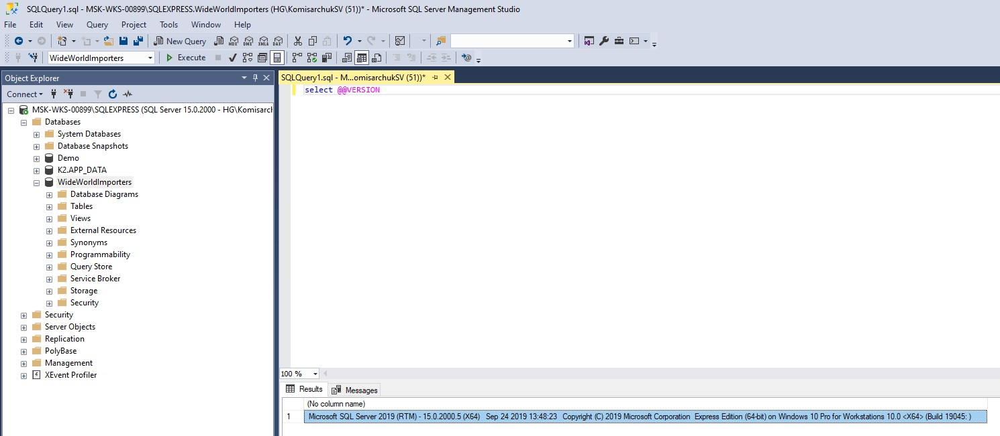

# Основные компоненты и архитектура SQL Server. ДЗ
___
## Цели занятия
знать разные виды систем управления баз данных и самих БД;
знать основные компоненты и архитектуру SQL Server;
быть знакомым с новыми возможностями SQL Server;
развернуть бэкап учебной базы.
___
## Краткое содержание
понятие БД вообще и SQL Server в частности;
возможности SQL Server;
настройка среды.
___
## Результаты
установленный SQL Server;
развернутый бэкап учебной базы данных.
___
## Преподаватель
Кристина Кучерова
___
## Дата и время
28 марта, четверг в 20:00.
Длительность занятия: 90 минут
___
## Материалы
[Основы GIT](https://www.youtube.com/playlist?list=PLnseyzyGdZddzvcrWY0CxZkU8IeL2_z7S)

[Базовый курс по GIT](https://www.youtube.com/playlist?list=PLIU76b8Cjem5B3sufBJ_KFTpKkMEvaTQR)
___
## Цель:
Вы установите SQL Server, SQL Management Studio и ряд других инструментов, которые понадобятся на курсе. Также развернете бэкап демонстрационной базы данных WideWorldImporters.
___

## Описание/Пошаговая инструкция выполнения домашнего задания:

Подробно выполнение ДЗ описано в методичке в личном кабинете (файл "Настройка окружения.pdf").

Для сдачи ДЗ пришлите ссылку на ваш репозиторий в чат с преподователем.

== Обязательная часть ==

Создайте github-репозиторий для хранения выполненных домашних заданий.
Установите SQL Server 2016\2017\2019 и SQL Server Management Studio.
Разверните у себя бэкап базы WideWorldImporters (из файла WideWorldImporters-Full.bak). Сделайте скриншот с восстановленной БД WideWorldImporters и выполненным select @@version. Скриншот разместите в вашем github-репозитории.
Прочитайте описание БД WideWorldImporters:
https://docs.microsoft.com/en-us/sql/samples/wide-world-importers-what-is
https://docs.microsoft.com/en-us/sql/samples/wide-world-importers-oltp-database-catalog

== Опциональная часть ==
Поставьте также SQL Sentry Plan Explorer и Visual Studio. Сейчас это необязательно, можно поставить позже, когда будут соответствующие темы.
В рамках курса предусмотрен проект. Работа над ним будет со второго модуля. Но если у вас уже есть идеи по проекту,
___
# Решение
